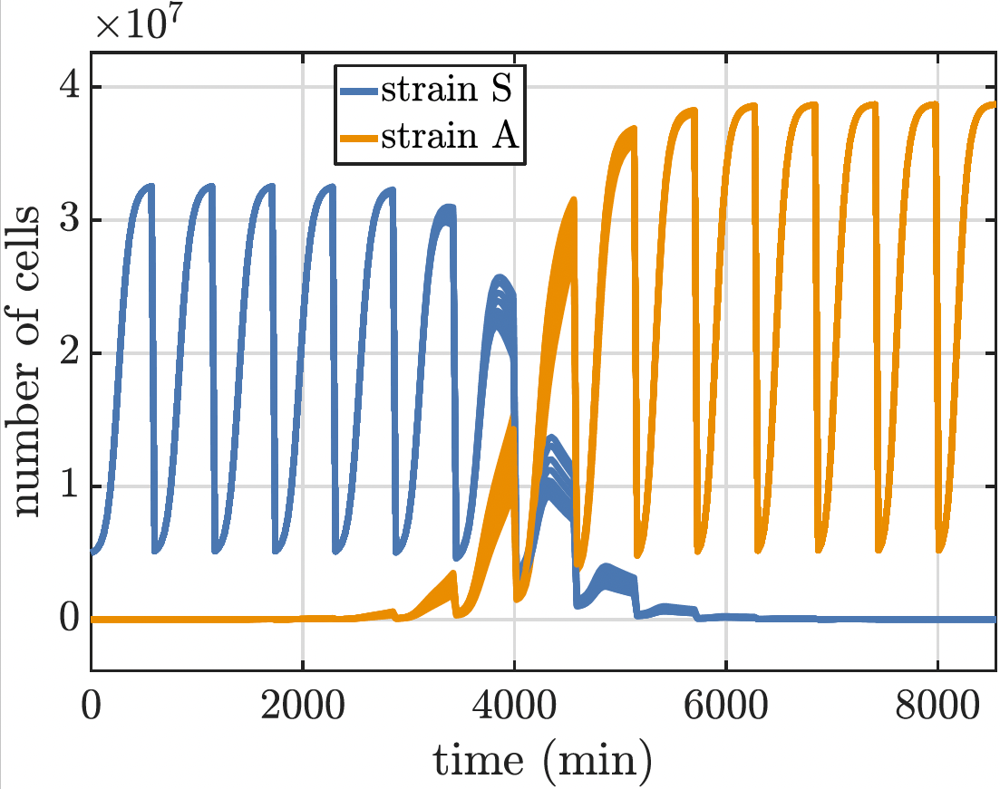

I am a postdoctoral researcher at the [Max Planck Institute for Evolutionary Biology](https://www.evolbio.mpg.de/2169/en). I am part of the [Stochastic Evolutionary Dynamics group](http://web.evolbio.mpg.de/stochdyn/index.html) (a.k.a. "The Rescue Team") led by Hildegard Uecker. My research aims at developing stochastic mathematical models that give a better insight into the combined effects of bottlenecks and relevant biological factors, such as competition or antibiotic selection, on the emergence of resistance. I seek to understand the role of bottlenecks on pathogen populations under extreme environmental conditions.......

[comment]: <> ()

[comment]: {: .align-center}

[comment]: <> ()

